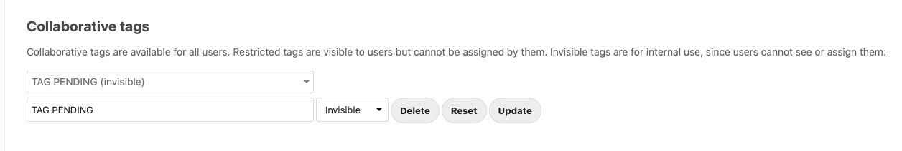
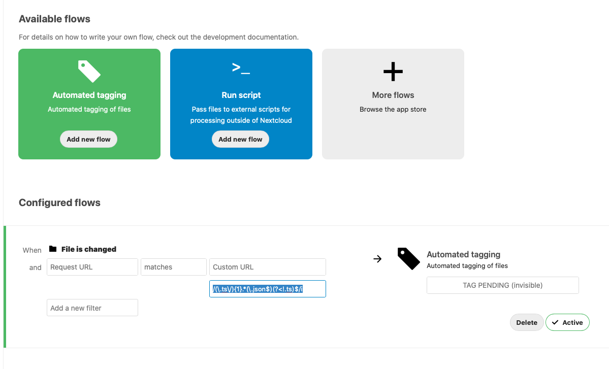
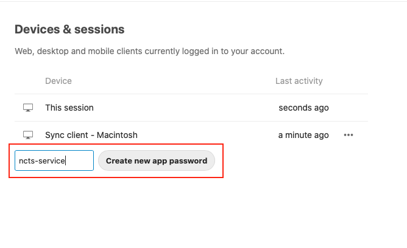
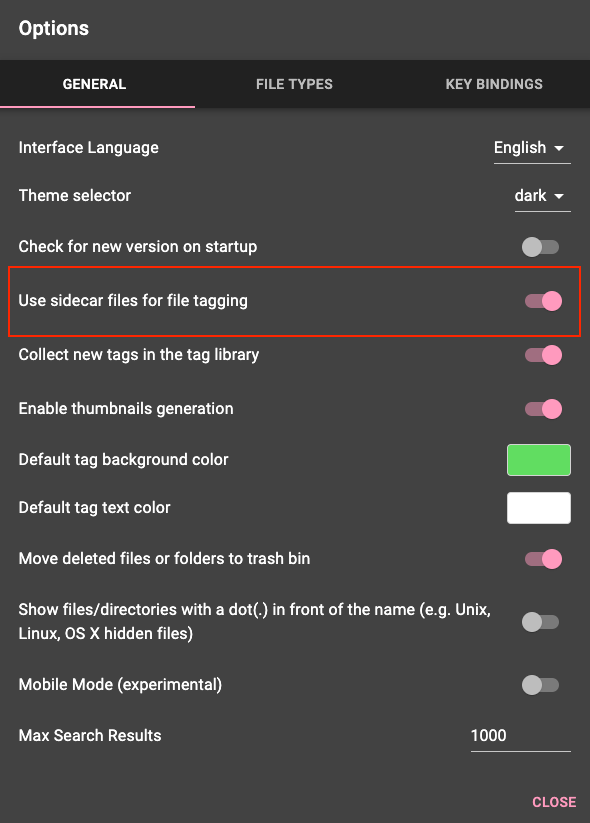
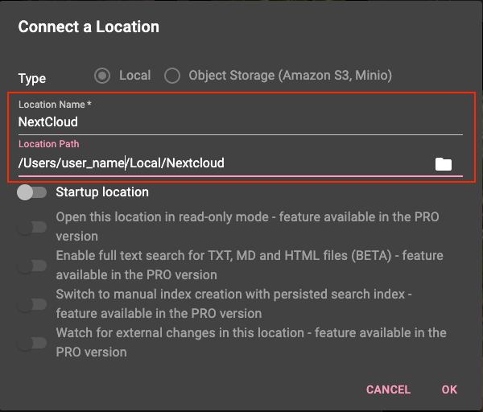

# Nextcloud - TagSpaces integration service

Microservice that replicates tags created with TagSpaces app, to Nextcloud.

[Nexcloud](https://nextcloud.com/) is a great environment to keep private files accesible from any device in the confort of your own private cloud.

[Tagspaces](https://www.tagspaces.org) is a great tool for classification of content files using tags with easy.

[Nextcloud has applications for mobile and desktop devices](https://github.com/nextcloud/desktop), the same as [TagSpaces](https://github.com/tagspaces/tagspaces).
Even that Nextcloud has it's own tag system, TagSpaces app excels in this task.

This integration service enables you to use TagSpaces desktop interfaces and apply changes to Nextcloud files.

## Motivation

This is a simple service implemented as an external process.

Even though this same functionality could be achieved as a native Nextcloud app, intention is to gain sight and experience on integrating more complex business processes into Nextcloud platform.

The main reason to choose the external service architecture was modern applications trend to microservices, enabling escalation and hight availability.

This integration service uses the great work done by hobigo with the [node-Nextcloud-client](https://github.com/hobigo/Nextcloud-node-client).

### How does it works

- You must enable TagSpaces and Nextcloud Desktop App, to share the folders and files you whan to sync.
- Service will read unprocessed TagSpaces files, and tag the corresponding files with the same tags that where given in TagSpaces app.

### Usage by an example

- Configure Nextcloud desktop app to sync files with your server at /users/user_name/Nextcloud.
- Configure Nextcloud server to mark TagSpaces description files for processing.
- Configure TagSpaces to work with files at /users/user_name/Nextcloud.
- Configure TagSpaces to create "sider car" json files with your tag activity.
- Work normally with TagSpaces, creating tags and associating them to your files.
- Tagging files will be synced to your Nextcloud server.
- Files at /users/user_name/Nextcloud/Photos/.ts/ will be marked for processing.
- Every minute, the service will query unprocessed files and create Nextcloud tags accordingly.

## Installation

1. Clone

``` bash
   git clone https://github.com/velocity-formula/nextcloud-tagspaces-integration-service.git
```

2. Build

``` bash
   cd nextcloud-tagspaces-integration-service

   docker build -t ncts-service .
```

3. Run

``` bash

   docker run --name ncts-service \
              --hostname ncts-service \
              --restart=always \
              --publish 6080:80 \
              --env NEXTCLOUD_USERNAME=active_nextcloud_user \
              --env NEXTCLOUD_PASSWORD=nextcloud_user_app_secret \
              --env NEXTCLOUD_SERVER_URL=nextcloud_host_url \
              --env NEXTCLOUD_INTEGRATION_TAGNAME="TAG PENDING" \
              --env NEXTCLOUD_CLEAR_PREVIOUS_TAGS=true \
              --detach ncts-service
```

### Service Configuration

#### required

- NEXTCLOUD_USERNAME: Nextcloud user name. Recommendation is to create a service user.
- NEXTCLOUD_PASSWORD: Device or service password created for this service application.
- NEXTCLOUD_SERVER_URL: Nextcloud service ulr. Include port if necessary.
- NEXTCLOUD_INTEGRATION_TAGNAME: The name of the tag that will be used in Nextcloud to mark the unprocessed tagspaces JSON files.

#### optionals

- NEXTCLOUD_CLEAR_PREVIOUS_TAGS: Indicates if service will clear any existing tags before applying the tags comming from TagSpaces app.

   ``` bash
      # Default value is false
      NEXTCLOUD_CLEAR_PREVIOUS_TAGS=[true|false]
   ```

- APP_CRON_TASK_ACTIVE: Activates recurrent task for capturing tag files changes.
  
   ``` bash
      # Default value is true
      APP_CRON_TASK_ACTIVE=[true|false]
   ```

- APP_CRON_INTERVAL: Service will query Nextcloud recurrently on every minute. To customize this interval, use a cron mask.
  
   ``` bash
      # Default is for every 1 minute: "*/1 * * * *"
      # Example for every 5 minutes:
      APP_CRON_INTERVAL="*/5 * * * *"
   ```

- CORS_ALLOW_ORIGINS: Indicates allowed CORS origins for api requests. Should change to reflect network installation evironment.

   ``` bash
      # Default is "localhost"
      CORS_ALLOW_ORIGINS="example.com"
   ```

Default values can be customized at ./src/config/.env file

## Service API

- /api/test-connect  :  test service connection to Nextcloud server.
- /api/process-tags  :  manually fires the integration process.
- /api/get-progress  :  gets progress and process queue status.

``` json
// htttp://ncts-service/api/get-progress
// response example

{
    "message": {
        "Process": "Nextcloud-tagspaces-integration-service",
        "IsActive": true,
        "IsBusy": true,
        "FilesInQ": 1,
        "Errors": 0,
        "PendingQ": [
            {
                "tag_file_name": "/Photos/.ts/20-05-29 08-15-28 2853.jpg.json",
                "taged_file": "/Photos/20-05-29 08-15-28 2853.jpg",
                "taged_file_old_tags": [],
                "user_name": "ServiceUserForNextcloud",
                "processing_status": "VALID",
                "isFile": true
            }
        ]
    }
}

```


## Nextcloud configuration

1. Download and enable Nextcloud Collaborative Tags App, Flow App and Automatic Tagging App.

2. Create a custom Nextcloud collaborative tag that will identify unprocess files. Ex. "TAG PENDING".
   - Nextcloud Administration -> Basic settings --> Create a new tag.
   - Make the new tag as "Invisible".
   

3. Create a new Automatic Tag Rule to mark TAGSPACES files for processing
   - Nextcloud Administration -> Flow --> Automated Tagging ---> Add new flow
   

      ```bash 
      #Example:
      When: "File is changed".
      and: "Request URL" matches "Custom URL reg expression" /(\.ts\/){1}.*(\.json$)(?<!.ts)$/i
      Automated tagging: "TAG PENDING"
      ```

4. Create a new App password to authenticate the integration service.
   - Nexcloud Personal Settings -> Security --> Create new app password.
   - Copy the created secret to configure the Integration Service.
   

## Nextcloud desktop app configuration

Download and configure with your preferences. Default configuration will point to /users/user_name/Nextcloud

## TagSpaces desktop app configuration

1. Download and install TagSpaces desktop app.

2. Configure Tagspaces app to use __sidecar__ type tag.
   - TagSpaces options -> General --> Use sidecar files for file tagging = ACTIVE.
   

   
   This will create a folder name ".ts" (hidden folder) that will contain a description file (JSON format) for the created tags.


3. Create a new location pointing to where Nextcloud files are
   - TagSpaces Location Manager -> Connect a Location
   


## Important notice

Besides the authentication created for the nextcloud user and CORS_ALLOW_ORIGINS environment variable, current implementation has no other security measures as service use is intended for **local internal** use only.

## License

This program is free software; you can redistribute it and/or modify
it under the terms of the GNU General Public License as published by
the Free Software Foundation; either version 2 of the License, or
(at your option) any later version.

This program is distributed in the hope that it will be useful, but
WITHOUT ANY WARRANTY; without even the implied warranty of MERCHANTABILITY
or FITNESS FOR A PARTICULAR PURPOSE. See the GNU General Public License
for more details.

The license text is available in the [LICENSE](LICENSE.txt) file.